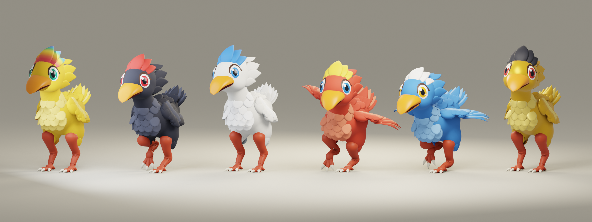

# チョコボ・レースモデル（第3版・ステイリオン型）

提供された参考画像（PS時代のレース画面、白・黄色の立ち姿、黒と黄色の3D顔アップ）の雰囲気をもとに、
Blenderのスクリプトで一から作った新しいモデルです。原作ゲームから抽出したものではありません。
既存の第2版（`../chocobo/`、まる型）とは別物として並べて置いてあり、第2版はそのまま使えます。



第2版との違い：

- 大きな頭、太く丸いくちばし（開閉可）、瞳の色つきの大きな目、後ろへ流れる頬とうなじの羽
- 胸のふわふわ（うろこ状に重なる羽）、羽毛の「ズボン」、赤く太い脚とうろこ、4本指の足
- 翼は羽根1枚ずつの作り。閉じると脇腹に沿い、開くと3本の骨で扇状に広がる
- **額羽（とさか）が独立したマテリアルと骨**を持つので、羽色とは別の色にでき、走ると風でなびく
- 脚は地面に足を固定するIKで作ってあり、接地中の足が滑らない（その場走りループ）

## 確認する

リポジトリのルートで `node server.cjs` を実行し、
[モデルスタジオ](http://127.0.0.1:4173/chocobo-preview.html) を開きます。
第3版が既定で表示され、「00 / モデル」で第2版に切り替えられます（`?model=v2`）。
7つのモーション、羽色10色、額羽6色（虹を含む）、再生速度・停止に対応。

## モーション

| glTF / Blenderアクション名 | 用途 | 翼 | 1周期 | 等倍の地面速度 |
|---|---|---|---|---|
| Idle | ゲート待機・停止 | 閉 | 3.00秒 | — |
| Run_StartDash | スタートダッシュ | 閉 | 0.633秒 | 3.40 m/s |
| Run_Cruise | 巡航 | 閉 | 0.733秒 | 2.34 m/s |
| Run_Corner | 左カーブ | 開 | 0.733秒 | 2.27 m/s |
| Run_Corner_R | 右カーブ | 開 | 0.733秒 | 2.27 m/s |
| Run_Downhill | 下り坂 | 半開き | 0.733秒 | 2.59 m/s |
| Run_LastSpurt | ラストスパート | 開 | 0.567秒 | 4.61 m/s |

- 待機：呼吸し、首をかしげて周りを見回し、ときどき「クエッ」と口を開けます。
- スタート〜巡航：翼は脇腹に沿わせたまま。体は弾んでも頭はほとんど揺れません。
- カーブ：体を内側へ約13°傾け、外側の翼を高く上げて左右にシーソーのように揺らしてバランスを取ります。頭はカーブの内側を向き、尾は外へ振れます。
- ラストスパート：翼を大きく広げて一歩ごとに羽ばたき、くちばしを開け、額羽は風で後ろへ流れます。
- 下り坂：依頼には含まれていませんが、既存の `selectClip` が返すため翼を半開きにした走りを用意しました。

すべてその場で走るループで、移動量（ルートモーション）は含みません。
「等倍の地面速度」は接地中の足が後ろへ動く速さです。レース側では
`action.timeScale = 実際の速さ / groundSpeed`（コース単位に合わせて換算）にすると足が滑りません。
切り替えは0.2秒程度のクロスフェードを想定。坂の角度・進行方向の回転はゲーム側でモデル全体に適用します。

`public/js/chocobo-animation.js` の `selectClip(flags)` は `turn: 'right'` を受け取ると `Run_Corner_R` を返します
（第2版には右カーブ用がないので、使う場合は `Run_Corner` にフォールバックしてください）。

## 羽色・額羽を変える

テクスチャ不要。マテリアルの色を変えるだけで、`manifest.json` に遺伝モデル（`RanchGenetics.COLORS` / `CRESTS`）と同じキーで色表があります。

| マテリアル | 内容 | manifestのキー |
|---|---|---|
| `Plumage_Main` | 体・翼・尾の基本色 | `palette[色].main` |
| `Plumage_Light` | 胸のふわふわ・羽の明るい部分 | `palette[色].light` |
| `Plumage_Dark` | 羽の裏・影側 | `palette[色].dark` |
| `Iris` | 瞳（黒は赤目、黄は緑目など羽色ごとに設定） | `palette[色].iris` |
| `Crest_Plume` | 額羽 | `crests[額羽]` |

- 金：上記に加えて羽のマテリアルに `metalness 0.45 / roughness 0.36` を設定するとつやが出ます。
- 虹の額羽：`crests.rainbow` の色を横方向のグラデーション画像（例：256×4のCanvasTexture、sRGB）にして
  `Crest_Plume.map` に設定し、色を白にします。UVのuは額羽の付け根（頭から出る所）0 → 先端1です。
- 個体ごとに色を変える場合はマテリアルを複製してください。実装例は `public/js/chocobo-preview.js` の `paint()`。

## ファイル・仕様

- `chocobo-v3.glb`：ゲーム用。約3.6 MB。1スキン・25ボーン・45,534三角形・14マテリアル・7クリップ。片面描画。
- `chocobo-v3.blend`：編集用。リグ、ウェイト、7アクション、撮影用スタジオ（`STUDIO_preview_only` はGLBに含まない）。
- `preview-*.png`：待機・巡航・カーブ・スパートと正面/側面/背面、色違い6羽の並び。
- `manifest.json`：頂点・三角形数、ボーン、マテリアル、色表、クリップ（秒数・翼の状態・地面速度・カーブ方向）。
- `../../../tools/build_chocobo_v3.py`：生成スクリプト（リポジトリ直下の `tools/`）。

BlenderはZ上・-Y前・+Xが鳥の左（`.L`）。GLBはY上・+Z前。身長は額羽の先まで約3.1単位。
ボーン：`Root → Body → Neck → Head → Jaw / Crest`、`Body → Tail`、
左右それぞれ `Thigh → Shin → Tarsus → Toes`、`Shoulder → Forearm → Fan1 / Fan2 / Fan3`。
複数羽を出すときは `SkeletonUtils.clone` で骨ごと複製し、個体ごとに `AnimationMixer` を作ります。
多数を同時に描く場合はLODやマテリアル統合を検討してください。

## Blenderで編集・再生成

`.blend` を開いて `Chocobo_Rig` を選び、Dope Sheet → Action Editorでアクションを選びます。
NLAトラックは書き出し用にミュートしてあります。フレーム範囲は1〜(周期×30+1)、既定は巡航。

```powershell
& 'C:\Program Files\Blender Foundation\Blender 3.2\blender.exe' --background --python tools/build_chocobo_v3.py
node --test tests/chocobo-v3.test.cjs
```

再生成すると `.glb` / `.blend` / プレビュー / manifest を上書きします。手で直した `.blend` は別名で保存してください。
形の確認だけなら `-- --quick=<出力先>`、動きの確認は `-- --anim=<出力先> --clip=Run_Corner` で連番画像を出せます。
形・動き・色はスクリプト上部の定数（`CLIPS`、`PALETTE`、翼の `FAN_ALPHA` など）で調整できます。
